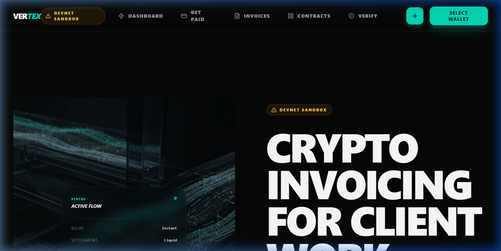

# Vertex ⚡
### High-Performance Crypto Invoicing & Surgical Settlement

[](https://solana.com)
[](https://nextjs.org)
[](https://supabase.com)
[](https://vertex-pay.vercel.app)

**The Surgical Point of Finality.**
Vertex is a professional-grade payments infrastructure designed for the Solana freelance economy. It is the high-performance intersection where professional agreements meet on-chain finality—focused on absolute precision, high-agency workflow, and institutional-grade trust.

[**Launch Live App 🚀**](https://vertex-pay.vercel.app)

---



## 🎯 Vision
Vertex solves the fragmentation in the Solana freelance economy. By bringing **Surgical Finality** to professional workflows, vertex empowers individuals to operate with the technical clarity and authority of an institution. Every transaction occurs at the exact intersection of agreement and execution.

## ✨ Core Features
- **⚡ Surgical Settlement**: Generate wallet-signed invoices with deep SVM finality.
- **🔗 Smart Payment Links**: Direct, cryptographic links for SOL, USDC, or USDT.
- **📜 Agreement Drafting**: Formal service agreements that transition seamlessly into invoices.
- **🔍 Precision Verification**: Automated server-side transaction signature verification.
- **📊 Business Dashboard**: Institutional-grade tracking of recent invoices, clients, and payment status.
- **🛡️ High-Agency Trust**: Separate wallet connection and Supabase session management for maximum security.

## 🛠️ Tech Stack
| Layer | Technology |
|---|---|
| **Framework** | Next.js 16 (App Router) |
| **Styling** | Tailwind CSS v4, Framer Motion (Spring Physics) |
| **Blockchain** | `@solana/web3.js`, `@solana/wallet-adapter` |
| **Backend** | Supabase (Postgres + RLS + Service Role Verification) |
| **Documents** | `jsPDF`, `jspdf-autotable`, `docx` |
| **Infrastructure** | Vercel |

## 🚀 Quick Start

### Prerequisites
- Node.js 18+
- Solana Wallet (Phantom, Solflare, etc.)
- Supabase Project

### Installation
```bash
git clone https://github.com/Ghostiemoh/vertex.git
cd vertex
npm install
cp .env.example .env.local
```

### Environment Setup
| Variable | Description |
|---|---|
| `NEXT_PUBLIC_SUPABASE_URL` | Supabase project URL |
| `NEXT_PUBLIC_SUPABASE_ANON_KEY` | Supabase anon key |
| `SUPABASE_SERVICE_ROLE_KEY` | Required for server-side verification |
| `NEXT_PUBLIC_SOLANA_NETWORK` | `devnet` or `mainnet-beta` |
| `NEXT_PUBLIC_SITE_URL` | `https://vertex-pay.vercel.app` |

### Database Initialization
1. Execute the SQL schema in your Supabase SQL Editor: [`src/lib/schema.sql`](./src/lib/schema.sql).
2. Enable Solana Web3 auth in Supabase settings if required.

### Development
```bash
npm run dev
```

---

## 🏗️ Architecture
- **State Management**: Optimized for high-intensity UI components with Framer Motion.
- **Security Protocols**: Narrow server routes for public payment links; explicit UI labeling for Sandbox (Devnet) vs Production (Mainnet).
- **Asset Integrity**: PDF generation with verification hashes embedded for audit trails.

---
*Built with precision on Solana.*
