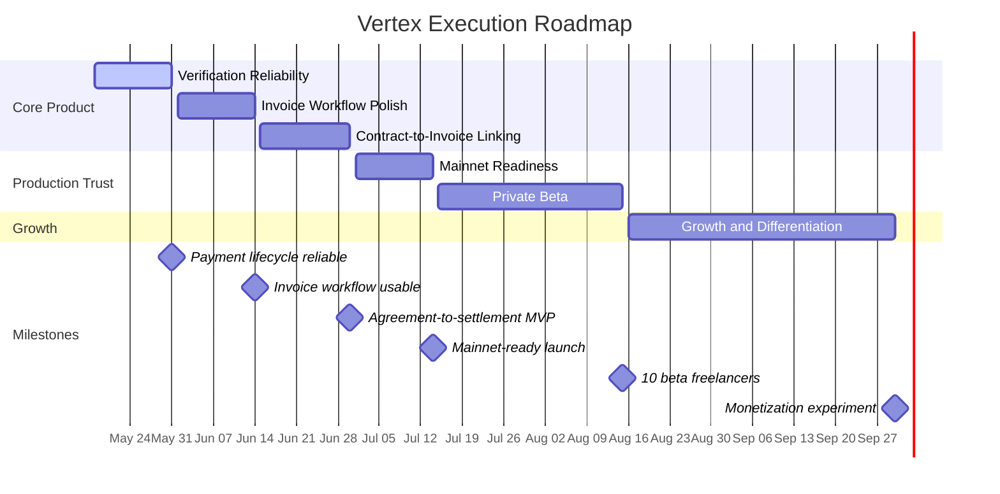

# Vertex Roadmap

**Roadmap date:** May 18, 2026  
**Product thesis:** Vertex is the professional settlement layer for Solana freelancers: agreement, invoice, payment link, verification, and business record in one precise workflow.

---

## North Star

Vertex wins when a freelancer can move from "we agreed on the work" to "the payment is final and recorded" without spreadsheets, screenshots, or unverifiable transaction hashes.

**Primary KPI:** Total Invoice Volume settled on-chain.  
**First operating target:** $5,000 settled volume and 10 active freelancers within the first month of mainnet-ready launch.

## Roadmap Chart

[Open the visual roadmap chart](./roadmap-chart.html)

## Live App Recalibration

After checking `https://vertex-pay.vercel.app` on May 18, 2026, Vertex should be treated as a live MVP, not a blank prototype. The deployed app already presents the core product surface: homepage, dashboard, invoice builder, direct payment links, contract creator, client management, verification, fee pages, and production-mode branding.

The roadmap therefore focuses on hardening, connecting, and proving the product rather than merely creating the first screens.

## Current Position

The product already has the right spine:

- Live Vercel deployment with public marketing pages, dashboard, invoice, contract, clients, payment, and verification routes.
- Solana wallet adapter support and network-aware devnet/mainnet configuration.
- Supabase schema for profiles, clients, invoices, contracts, payment requests, and payment events.
- Server-side payment verification route with transaction signature checks.
- Payment links for SOL, USDC, and USDT.
- Invoice builder with live preview, QR generation, PDF export, email dispatch, and social/link relay.
- Contract creator with live document preview, wallet signature flow, QR verification link, and PDF export.
- Direct payment link creator with fee preview and optional dashboard save.
- Dashboard with demo mode, authenticated records, revenue cards, recent invoices, and quick payment actions.
- Email invoice endpoint and React Email template.
- CI pipeline for lint, tests, and build.

The next work should concentrate on reliability, status accuracy, production trust, and connected workflows rather than adding broad new features too early.

---

## Phase 1: Verification & Settlement Reliability

**Target window:** May 18 - May 31, 2026  
**Goal:** Make the live payment lifecycle dependable enough for real users.

### Ship

- Harden transaction verification for SOL, USDC, and USDT across devnet and mainnet-beta.
- Make payment status transitions explicit: sent, viewed, submitted, confirmed, finalized, failed.
- Add visible lifecycle history on invoice and payment pages using `payment_events`.
- Add retry-safe verification so repeated POSTs do not duplicate or corrupt payment state.
- Add RPC failover telemetry for each verification attempt.
- Add manual QA scripts for invoice payment, direct payment link, failed payment, and finality sync.
- Expand tests for payment encoding, token mint selection, transfer validation, memo validation, and failed verification paths.

### Acceptance Criteria

- A payment link can be created, opened, paid, verified, and finalized without manual database edits.
- Incorrect recipient, amount, mint, network, or memo fails verification with a clear reason.
- Dashboard totals count only finalized payments.
- CI passes on every push.

---

## Phase 2: Invoice Workflow Polish

**Target window:** June 1 - June 14, 2026  
**Goal:** Turn the existing invoice builder into a polished billing workflow.

### Ship

- Tighten invoice validation for required fields, token amounts, dates, wallet addresses, and email.
- Add invoice detail pages for editing drafts, viewing sent invoices, resending emails, and checking settlement state.
- Improve PDF metadata with payment ID, verification link, network, wallet, and finality status.
- Add resend state and delivery feedback to the email invoice flow.
- Improve client management so saved clients can be reused from invoice and contract flows.
- Add empty states, loading states, and form validation for all invoice surfaces.

### Acceptance Criteria

- A freelancer can create an invoice from a saved client in under two minutes.
- The client can pay from the shared link without creating a Vertex account.
- The freelancer can download or email a professional PDF.
- Each finalized invoice has an auditable transaction signature and timestamp.

---

## Phase 3: Contract-to-Invoice Linking

**Target window:** June 15 - June 30, 2026  
**Goal:** Turn Vertex from a payment link tool into an agreement-to-settlement system.

### Ship

- Link existing contract drafts to one or more invoices.
- Add contract detail pages with status, linked invoices, signature metadata, and verification QR.
- Add wallet-signed contract finalization records to Supabase, not only exported PDF output.
- Add contract DOCX export if users need editable legal handoff.
- Add contract status: draft, sent, signed, invoiced, completed, cancelled.
- Add dashboard cards for unsigned contracts, overdue invoices, and finalized revenue.

### Acceptance Criteria

- A contract can be drafted, signed, exported, and linked to an invoice.
- Invoice records preserve their originating contract context.
- Users can see which agreements have not yet been paid.

---

## Phase 4: Mainnet Readiness

**Target window:** July 1 - July 14, 2026  
**Goal:** Prepare Vertex for real production payment volume.

### Ship

- Run a security review of auth, RLS policies, API routes, payment verification, and environment variables.
- Add strict Zod validation for all form input and API payloads.
- Add rate limiting or abuse protection to public payment and email routes.
- Separate sandbox and production UX clearly across all payment surfaces.
- Add production RPC provider configuration and fallback strategy.
- Add monitoring for payment failures, email failures, RPC errors, and verification latency.
- Write a production launch checklist covering Supabase, Vercel, wallet configuration, RPC keys, Resend, and legal pages.

### Acceptance Criteria

- Mainnet mode cannot be confused with devnet mode.
- Public routes expose only the data required for a client to pay.
- RLS policies protect all owner-scoped business records.
- The product has an operator checklist for incident response.

---

## Phase 5: Private Beta

**Target window:** July 15 - August 15, 2026  
**Goal:** Prove that real freelancers will use Vertex for actual billing.

### Ship

- Onboard 10 high-ticket freelancers or agencies.
- Track activation funnel: connected wallet, created invoice, sent invoice, client opened link, payment finalized.
- Add lightweight feedback capture after invoice creation and payment finalization.
- Build a founder dashboard for active users, invoice volume, conversion, failed payments, and token mix.
- Create onboarding docs for freelancers and a short client payment guide.
- Publish one case study from a completed Vertex invoice flow.

### Acceptance Criteria

- 10 active freelancer accounts.
- $5,000 in finalized invoice volume.
- At least 3 users create more than one invoice.
- At least 80% of beta payment links finalize without founder support.

---

## Phase 6: Growth and Differentiation

**Target window:** August 16 - September 30, 2026  
**Goal:** Move beyond MVP into defensible workflow depth.

### Ship

- Recurring invoices for retainers.
- Milestone-based invoices linked to contracts.
- CSV export and accountant-friendly reporting.
- Shareable client portal for paid/unpaid invoices.
- Optional Vertex fee model: subscription, basis-point fee, or pro tier.
- Partner outreach to Solana freelancers, agencies, dev shops, and Superteam communities.

### Acceptance Criteria

- Users can manage repeat billing without recreating invoices manually.
- Vertex has a clear monetization experiment.
- Product messaging is focused on professional settlement, not generic crypto payments.

---

## Later Bets

These should wait until the core workflow is trusted:

- Escrow for milestone work.
- Multi-signature approvals for agencies.
- Reputation layer based on finalized invoice history.
- Stablecoin offramp integrations.
- Team workspaces.
- API access for agencies and marketplaces.
- Cross-chain invoice intake while settling natively on Solana.

---

## Operating Rhythm

- **Weekly:** Ship one user-visible improvement and one reliability improvement.
- **Biweekly:** Review KPI movement, open bugs, beta user feedback, and roadmap scope.
- **Monthly:** Publish a concise product update with shipped work, volume settled, and next milestone.

## Decision Rules

- Prefer reliability over new feature breadth until private beta payments are stable.
- Treat invoice finality, status accuracy, and RLS safety as non-negotiable.
- Do not add marketplace, escrow, or reputation features before the invoice and contract workflow is dependable.
- Keep Vertex positioned for high-agency freelancers and independent agencies, not general ecommerce checkout.
